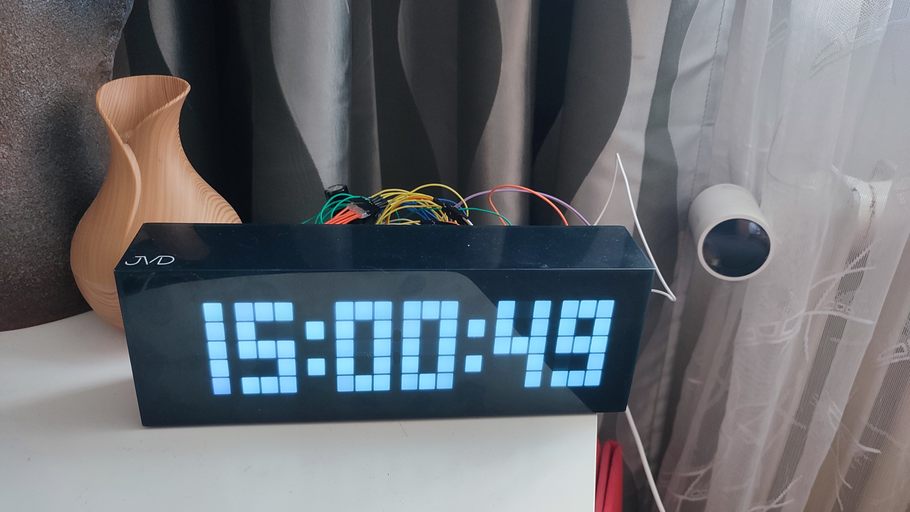

# Digital clock rework

This is a simple personal HW+SW project. My goal here was to upgrade/fix an old JVD digital clock to automatically set time using NTP and to automatically adjust for DST. 

Features:
 - NTP synchronized clock
 - Automatic DST adjustment
 - Time based auto dimming

I decided to completely remove the old electronic board and replace it with a new one. While this meant that I'll lose some of the functions like alarm, temperature monitoring or gestures control, it wasn't an issue for me because I hadn't used any of this for several years.
So the goal was to get a "turn on and forget"-style digital clock.

There was an 20x5 white LED matrix (with some empty positions) inside connected to a 16 (virtual columns) + 6 pin (virtual rows) header.
My idea was to connect these LEDs to the MAX7219 ICs and add ESP32 or ESP8266 as a controller and as a time source. 

This came out as a bit more complicated then I originally thought because while the MAX7219 can be daisy chained each IC can only control it's own matrix of 8x8 LEDs. In other words I couldn't use the original 16x6 matrix and I had to split it into 8x6 + 8x6.
I used a sharp knife and some soldering to do this.

TODO

# Software

Most of the code just handles mapping the logical pixels to the right values for MAX7219 ICs. And I used a built in library functions to fetch time from NTP.

After powering up the clock displays a short self test (all segments fully on), then "0" while it's connecting to WiFi, then "-- -- --" as it's waiting for a sync. Once it knows the time it just displays it like any other clock do.

## Libraries used

- MD_MAX72XX @ 3.1.5
- WiFiManager @ latest (2.0.17)
- Timemark @ 1.0.0
- Syslog @ 2.0.0
